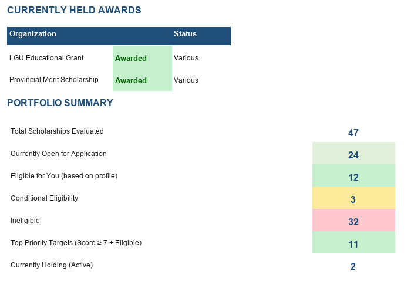
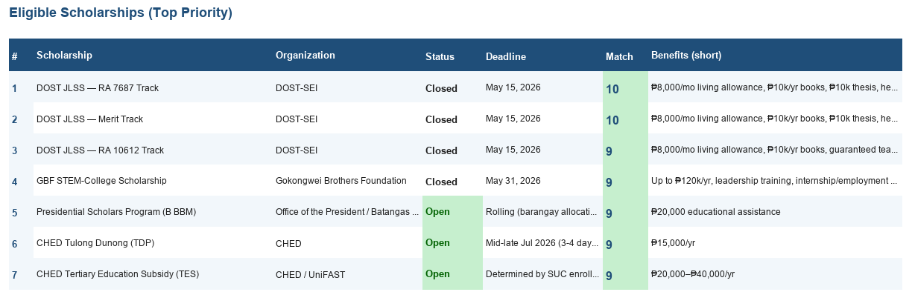
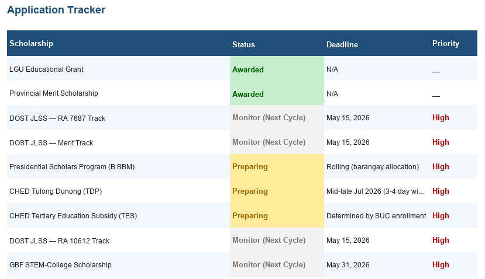
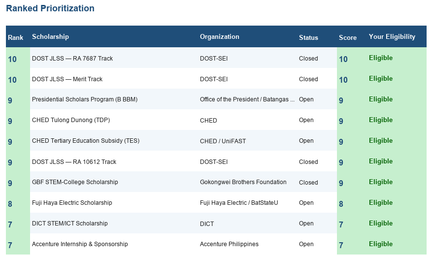

<div align="center">


# Iskolar Tracker

*A data-driven scholarship portfolio manager for Filipino SUC students*

[](https://python.org)
[](https://openpyxl.readthedocs.io)
[](https://python-pillow.org)
[](http://makeapullrequest.com)

[Overview](#overview) • [Features](#features) • [Quick Start](#quick-start) • [Project Structure](#project-structure) • [Customization](#customization) • [How It Works](#how-it-works)

</div>

Transform a raw scholarship analysis into a structured, color-coded Excel workbook with automated eligibility scoring. Designed for Filipino undergraduates navigating 40+ national, LGU, and corporate scholarship programs.




## Overview

The Philippine tertiary funding landscape is a maze of programs — DOST, CHED, UniFAST, GBF, LGU grants — each with its own deadlines, eligibility rules, and compatibility constraints. This project:

1. **Parses** 47 scholarship entries from a structured analysis document
2. **Scores** each against a configurable student profile (course, year level, residency, existing awards)
3. **Generates** a 7-sheet Excel workbook with auto-filters, color-coding, and cross-sheet references

> [!TIP]
> The eligibility engine is parametrized — change the `PROFILE` dict at the top of `build_tracker.py` to adapt it to your own situation.

## Features

**Eligibility Engine** — Automatically evaluates each scholarship against year level, course fit, residency restrictions, gender-specific grants, and award compatibility clauses.

**7-Sheet Workbook** — From a dashboard with portfolio stats and upcoming deadlines to a tactical manuals sheet with per-scholarship strategic guides.

**Color-Coded** — Green for eligible, red for ineligible, yellow for conditional. Open scholarships highlighted. Hyperlinks on every URL.

**Portfolio-Ready** — Ships with a `capture_screenshots.py` script that renders clean table images from the workbook without any external renderer.

## Quick Start

```bash
# Clone and install
git clone https://github.com/yourusername/iskolar-tracker.git
cd iskolar-tracker
pip install -r requirements.txt

# Generate the tracker (edit PROFILE first for your data)
python build_tracker.py

# (Optional) Regenerate screenshots
python capture_screenshots.py
```

The output `iskolar-tracker.xlsx` will appear in the project root, ready to use.

## Project Structure

```
iskolar-tracker/
├── build_tracker.py                   # Workbook generator with eligibility engine
├── capture_screenshots.py             # Renders table screenshots via Pillow
├── requirements.txt                   # openpyxl + pillow
├── iskolar-tracker.xlsx               # Sample output (demo profile)
├── data/
│   └── scholarship-analysis-source.txt # Source analysis document (redacted)
├── screenshots/
│   ├── 01-dashboard.png
│   ├── 02-eligible-list.png
│   ├── 03-application-tracker.png
│   └── 04-ranked-priorities.png
└── README.md
```

## Customization

Edit the `PROFILE` block at the top of `build_tracker.py`:

```python
PROFILE = {
    "name": "Your Name",
    "course": "BSIT",
    "year": "Incoming 3rd Year",
    "school": "Batangas State University",
    "municipality": "Your Municipality, Province",
    "is_female": False,
    "held_awards": ["LGU Educational Grant", "Provincial Merit Scholarship"],
}
```

The engine uses these fields to determine eligibility for all 47 scholarships. Add or remove held awards; the conflict-checker will adjust automatically.

## How It Works

### Data Pipeline

The source analysis document is a structured text file with 47 scholarship entries, each containing 20+ fields (name, org, deadlines, benefits, requirements, compatibility rules). `build_tracker.py` reads this data, runs it through the eligibility engine against your profile, and outputs a formatted Excel workbook.

### Eligibility Logic

Each scholarship is evaluated on five axes:

| Axis | Example Exclusion |
|---|---|
| Year level | Freshman-only programs (CMSP, SM, InLife) |
| Course/Program | BSIT vs. Medicine, Education, Architecture |
| Residency | Batangas City, San Juan, or province-specific |
| Gender | Female-only (Generation Google, Ayala U-Go) |
| Award conflict | "No other scholarship" clauses (Megaworld, Ayala) |

### Workbook Sheets




| Sheet | Contents |
|---|---|
| **Dashboard** | Profile summary, held awards, portfolio stats, upcoming deadlines |
| **Master List** | All 47 scholarships with 21 fields + eligibility column |
| **My Eligible Scholarships** | Filtered view of what you can actually apply for |
| **Application Tracker** | Status tracking: Preparing → Applied → Interviewing → Awarded |
| **Ranked Prioritization** | Eligible scholarships sorted by match score and probability |
| **Comparison Matrix** | Abbreviated side-by-side of all 47 programs |
| **Tactical Manuals** | Per-scholarship guides: doc prep, interview tips, execution issues |

> [!NOTE]
> Monetary values are in Philippine Pesos (₱) unless noted. The sample data uses a demo profile with anonymized information to protect privacy.

## Data Source

Scholarship information was compiled from official government and corporate portals including DOST-SEI, CHED, UniFAST, GBF, DICT, and various LGU and private foundation programs for Academic Year 2026–2027.
